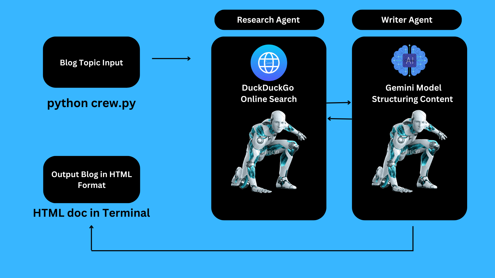

# AI BLOGGER AGENT

## Project Description
This AI Blogger Agent is a crew consisting of two agents: the Researcher and the Writer. The Researcher agent researches and brainstorms the given topic, then hands over the findings to the Writer agent to compose the report. If the Writer agent finds anything unsatisfactory, it calls upon the Researcher to perform further research. Through this iterative process, the final blog is crafted to meet the highest standards.




## Tools Used
- **Programming Languages:** [Python]
- **Frameworks:** [Langchain, CrewAI]
- **Libraries:** [duckduckgo_search, langchain_google_genai, crewai_tools]

## Installation Steps

1. **Clone the Repository**
    ```sh
    git clone https://github.com/yourusername/your-repository.git
    ```

2. **Navigate to the Project Directory**
    ```sh
    cd your-repository
    ```

3. **Install Dependencies**
    ```sh
    pip install -r requirements.txt

4. **Setup Environment Variables**
    - In `.env` file provide the required api keys
    - Add the necessary environment variables as specified in `.env.example` or the documentation.
    - Give a topic before the run

5. **Run the Project**
    ```sh
    python crew.py


## Usage
The Agent can create a blog which is uptodate and prescise the long contexts and therby provides final blog in a html format. It uses DuckDuckGo Search to browse online to get the latest trends without being outdated and also uses gemini flash model via API to structure the contents iteratively.

## Contributing
If you'd like to contribute, please fork the repository and use a feature branch. Pull requests are warmly welcome.

## License
This project is licensed under the [Your License] - see the LICENSE.md file for details.
